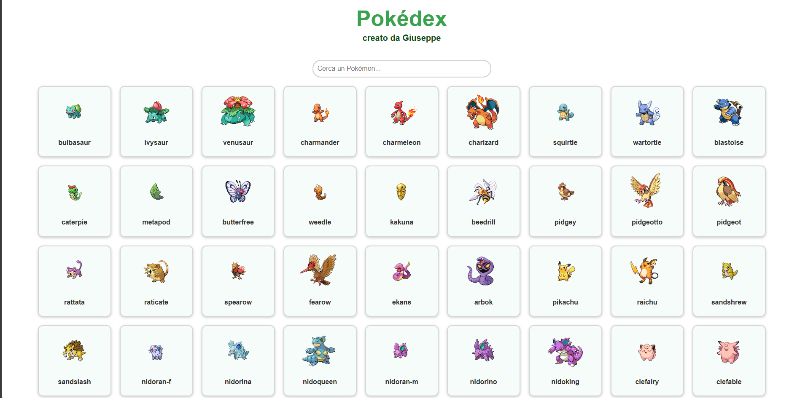
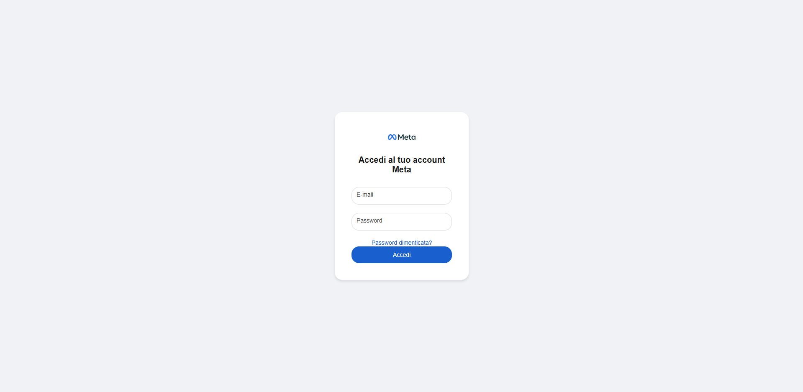

# Portfolio di Giuseppe Lizzio

Benvenut* nel mio portfolio! Questi sono i miei progetti, vai a dargli un occhiata!

## [Pokédex](https://github.com/yoorstel/Pokedex)

In questo progetto **Pokedex** l'utente può:
1. **Vedere** una lista di Pokémon appena apre l’app
2. **Cercare** un Pokémon scrivendo il nome nella barra di ricerca

## [Meta Login](https://github.com/yoorstel/Meta-Login)

